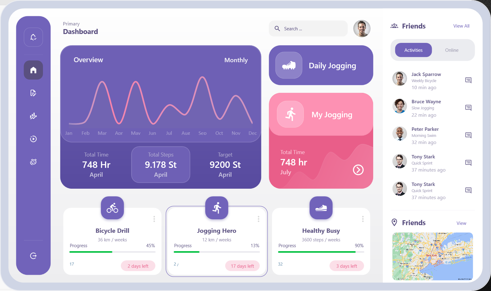
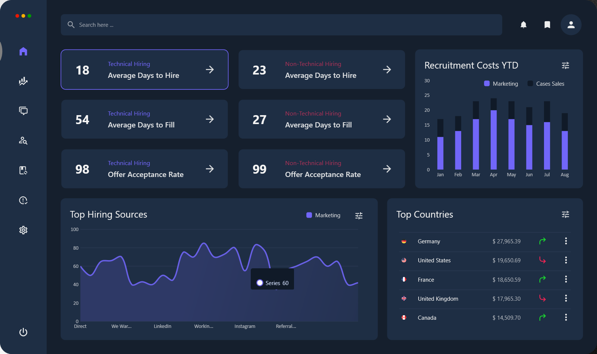

# WPF Projects Collection

This repository contains various WPF projects I've worked on. Some of these projects were created by following tutorial videos for learning purposes, while others are my own original work. Each project includes a brief description and a screenshot.

# How to Run the Projects
To run any of the projects, follow these steps:

1. Clone this repository: `git clone https://github.com/yusufbuyruk/wpf-samples.git`
2. Open the relevant project in Visual Studio.
3. Build and run the project.
  
**OR**

4. Download the Live Demo ZIP file, extract it, and run the `.exe` file.

---

## 1. Dark Admin Panel (Live Charts)
### Description
Live Demo: [Download ZIP (EXE)](https://github.com/yusufbuyruk/wpf-samples/raw/main/portfolio/executable/dark-admin-panel.zip)

Source code: [Link to the Project Folder](./wpf-ui-collection-02/dark-admin-panel/)

---

## 2. Fitness Tracker (Live Charts)
### Description
Live Demo: [Download ZIP (EXE)](https://github.com/yusufbuyruk/wpf-samples/raw/main/portfolio/executable/fitness-tracker.zip)

Source code: [Link to the Project Folder](./wpf-ui-collection-01/fitness-tracker/)

---

## 3. Recruitment Dashboard (Live Charts)
### Description
Live Demo: [Download ZIP (EXE)](https://github.com/yusufbuyruk/wpf-samples/raw/main/portfolio/executable/recruitment-dashboard.zip)

Source code: [Link to the Project Folder](./wpf-ui-collection-01/recruitment-dashboard/)

---
