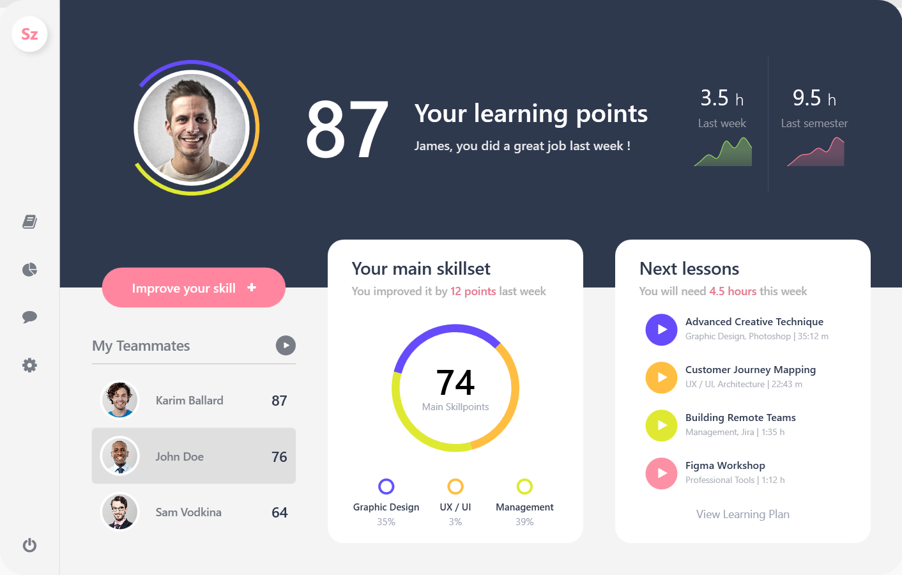

# WPF Projects Collection

This repository contains various WPF projects I've worked on. Some of these projects were created by following tutorial videos for learning purposes, while others are my own original work. Each project includes a brief description and a screenshot.

# How to Run the Projects
To run any of the projects, follow these steps:

1. Clone this repository: `git clone https://github.com/yusufbuyruk/wpf-samples.git`
2. Open the relevant project in Visual Studio.
3. Build and run the project.
  
**OR**

4. Download the Live Demo ZIP file, extract it, and run the `.exe` file.

---

## 1. Dark Admin Panel (Live Charts)
### Description
Live Demo: [Download ZIP (EXE)](https://github.com/yusufbuyruk/wpf-samples/raw/main/portfolio/executable/dark-admin-panel.zip)

Source code: [Link to the Project Folder](./wpf-ui-collection-02/dark-admin-panel/)

---

## 2. Fitness Tracker (Live Charts)
### Description
Live Demo: [Download ZIP (EXE)](https://github.com/yusufbuyruk/wpf-samples/raw/main/portfolio/executable/fitness-tracker.zip)

Source code: [Link to the Project Folder](./wpf-ui-collection-01/fitness-tracker/)

---

## 3. Recruitment Dashboard (Live Charts)
### Description
Live Demo: [Download ZIP (EXE)](https://github.com/yusufbuyruk/wpf-samples/raw/main/portfolio/executable/recruitment-dashboard.zip)

Source code: [Link to the Project Folder](./wpf-ui-collection-01/recruitment-dashboard/)

---

## 4. Sales Dashboard (Live Charts)
### Description
Live Demo: [Download ZIP (EXE)](https://github.com/yusufbuyruk/wpf-samples/raw/main/portfolio/executable/sales-dashboard.zip)

Source code: [Link to the Project Folder](./wpf-ui-collection-01/sales-dashboard/)

---

## 5. Skill Dashboard (Live Charts)
### Description
Live Demo: [Download ZIP (EXE)](https://github.com/yusufbuyruk/wpf-samples/raw/main/portfolio/executable/skill-dashboard.zip)

Source code: [Link to the Project Folder](./wpf-ui-collection-01/skill-dashboard/)

---

## 6. TV App (Live Charts)
### Description
Live Demo: [Download ZIP (EXE)](https://github.com/yusufbuyruk/wpf-samples/raw/main/portfolio/executable/tv-app.zip)

Source code: [Link to the Project Folder](./wpf-ui-collection-01/tv-app/)

---

## 7. Calendar
### Description
Live Demo: [Download ZIP (EXE)](https://github.com/yusufbuyruk/wpf-samples/raw/main/portfolio/executable/calendar.zip)

Source code: [Link to the Project Folder](./wpf-ui-collection-02/calendar/)

---

## 8. Chat App
### Description
Live Demo: [Download ZIP (EXE)](https://github.com/yusufbuyruk/wpf-samples/raw/main/portfolio/executable/chat-app.zip)

Source code: [Link to the Project Folder](./wpf-ui-collection-02/chat-app/)

---

## 9. Dashboard
### Description
Live Demo: [Download ZIP (EXE)](https://github.com/yusufbuyruk/wpf-samples/raw/main/portfolio/executable/dashboard.zip)

Source code: [Link to the Project Folder](./wpf-ui-collection-02/dashboard/)

---

## 10. DataGrid
### Description
Live Demo: [Download ZIP (EXE)](https://github.com/yusufbuyruk/wpf-samples/raw/main/portfolio/executable/datagrid.zip)

Source code: [Link to the Project Folder](./wpf-ui-collection-02/datagrid/)

---

## 11. Flat Login Page
### Description
Live Demo: [Download ZIP (EXE)](https://github.com/yusufbuyruk/wpf-samples/raw/main/portfolio/executable/flat-login-page.zip)

Source code: [Link to the Project Folder](./wpf-ui-collection-02/flat-login-page/)

---

## 12. Input Form
### Description
Live Demo: [Download ZIP (EXE)](https://github.com/yusufbuyruk/wpf-samples/raw/main/portfolio/executable/input-form.zip)

Source code: [Link to the Project Folder](./wpf-ui-collection-02/input-form/)

---

## 13. Instagram App
### Description
Live Demo: [Download ZIP (EXE)](https://github.com/yusufbuyruk/wpf-samples/raw/main/portfolio/executable/instagram-app.zip)

Source code: [Link to the Project Folder](./wpf-ui-collection-02/instagram-app/)

---

## 14. Login Page
### Description
Live Demo: [Download ZIP (EXE)](https://github.com/yusufbuyruk/wpf-samples/raw/main/portfolio/executable/login-page.zip)

Source code: [Link to the Project Folder](./wpf-ui-collection-02/login-page/)

---

## 15. Music Player
### Description
Live Demo: [Download ZIP (EXE)](https://github.com/yusufbuyruk/wpf-samples/raw/main/portfolio/executable/music-player.zip)

Source code: [Link to the Project Folder](./wpf-ui-collection-02/music-player/)

---

## 16. Register Page
### Description
Live Demo: [Download ZIP (EXE)](https://github.com/yusufbuyruk/wpf-samples/raw/main/portfolio/executable/register-page.zip)

Source code: [Link to the Project Folder](./wpf-ui-collection-02/register-page/)

---

## 17. Shopping Cart
### Description
Live Demo: [Download ZIP (EXE)](https://github.com/yusufbuyruk/wpf-samples/raw/main/portfolio/executable/shopping-cart.zip)

Source code: [Link to the Project Folder](./wpf-ui-collection-02/shopping-cart/)

---

## 18. Sign-Up Form
### Description
Live Demo: [Download ZIP (EXE)](https://github.com/yusufbuyruk/wpf-samples/raw/main/portfolio/executable/sign-up-form.zip)

Source code: [Link to the Project Folder](./wpf-ui-collection-02/sign-up-form/)

---

## 19. Smart Home App
### Description
Live Demo: [Download ZIP (EXE)](https://github.com/yusufbuyruk/wpf-samples/raw/main/portfolio/executable/smart-home-app.zip)

Source code: [Link to the Project Folder](./wpf-ui-collection-02/smart-home-app/)

---

## 20. Wallet Payment
### Description
Live Demo: [Download ZIP (EXE)](https://github.com/yusufbuyruk/wpf-samples/raw/main/portfolio/executable/wallet-payment.zip)

Source code: [Link to the Project Folder](./wpf-ui-collection-02/wallet-payment/)

---

## X. Weather App
### Description
Live Demo: [Download ZIP (EXE)](https://github.com/yusufbuyruk/wpf-samples/raw/main/portfolio/executable/weather.zip)

Source code: [Link to the Project Folder](./wpf-ui-collection-02/weather/)

---

## X. Xxxxx
### Description
Live Demo: [Download ZIP (EXE)](https://github.com/yusufbuyruk/wpf-samples/raw/main/portfolio/executable/xxxxx.zip)

Source code: [Link to the Project Folder](./wpf-ui-collection-02/xxxxx/)

---
